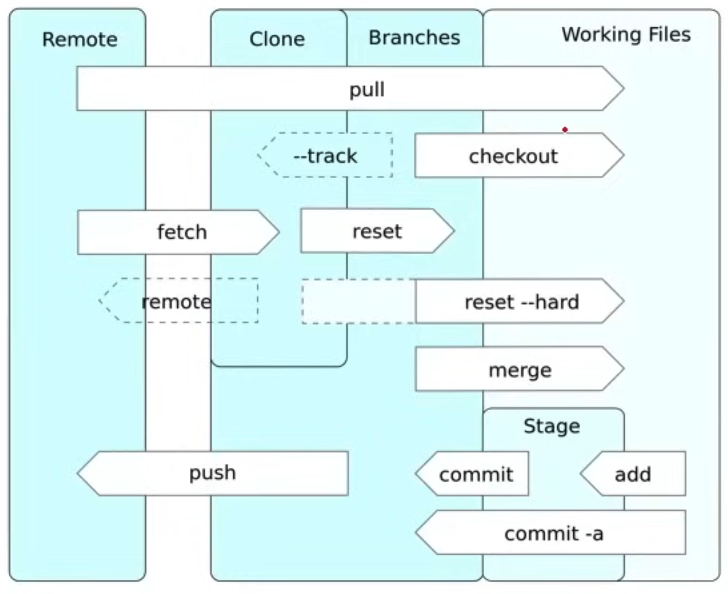
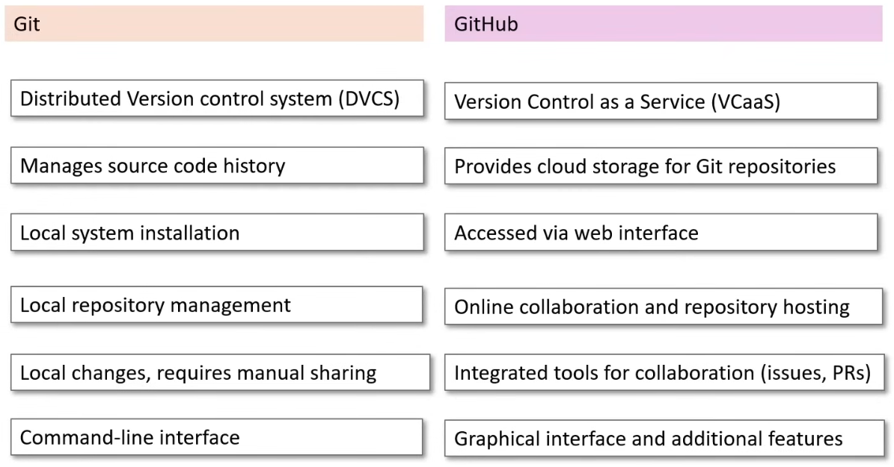

# GitHub Basics

**Version Control Systems (VCS)** - Designed to track changes or revisions to code.

## Git

**Git** - A distributed version control systems (DVCS) created by Linus Torvald.

### Common Git Terms



- **Repository** - Represents the logic container holding the codebase.

- **Commit** - Represents a change of data in the local repo.

- **Tree** - Represents the entire history of a repo.

- **Remote** - A version of your project hosted elsewhere, used for exchanging commits.

- **Branches** - Divergent paths of development, allowing isolated changes.
  - Main - The most common name for the default branch.

- **Clone** - Creates a compte local copy of a repository, including its history.

- **Checkout** - Switches between different branches or commits in your repo.

- **Pull** - Downloads changes from a remote repository and merges them into your branch.

- **Push** - Uploads your local repository changes to a remote repository.

- **Fetch** - Downloads data from a remote repo without integrating it into your work.

- **Reset** - Undoes local changes, with options to unstage or revert commits.

- **Merge** - Combines multiple commit histories into one.

- **Staging files** - Prepares and organizes changes for a commit.
  - Commit - Saves your changes as a snapshot in the local repository.
  - Add - Adds changes to the staging area for the next commit.

## Version Control Services (VCS)

**Version Control Services (VCS)** - Fully managed cloud services that hosts your version controlled repositories.

- Often called "git providers"
- Git Providers:
  - Github
  - GitLab
  - BitBucket

## GitHub

**GitHub** - Version Control Service that initially offered hosting managed remote git repos and has expanded to provide other offerings around hosted codebases.

- Originally built with Ruby on Rails!

**Git VS GitHub**


**Github Repo** - Your git repo that you push upstream to GitHub. GitHub then allows you to access and manage your git repo with several different functionalities:

    - View different branches
    - View tags
    - View commit history
    - Explore repo's files
    - View releases
    - See codebase language breakdown
    - View top level markdown files
        - README.md
        - License.md
    - Perform actions such as forking, staring and cloning.

## Cloning

We can clone three ways: HTTPS, SSH and GitHub CLI

### HTTPS

```sh
git clone https://github.com/alexandroivaldez/repoName
```

### SSH

### GitHub CLI

<!-- ``` -->

### Commit Shaw

When you make a commit to save your work, Git creates a unique ID (a.k.a. the "SHA" or "hash") that allows you to keep record of the specific changes committed along with who made them and when.

### Stashing

```sh
git stash list
git stash
git stash save my-name
git stash apply
git stash pop
```

### Pull Request

Asks someone to review your code and merge it to the repo you are trying to make changes into.

### Commit

A git commit represents incremental changes to a codebase represented with a git tree (graph) at a specific time.

- Commit Has: A unique SHA-1 hash identifier for the commit.
- Author Information: The name and email of the person who made the commit.
- Commit Message: A description of what changes the commit contains.
- Timestamp: The date and time when the commit was made.
- Parent Commit Hash(es): The SHA-1 hash of the commit(s) this commit is based on.
- Snapshot of Content: A snapshot of the project at the time of the commit (not the actual files but references to them).

### Git Commands

**Files to be staged**

- git add file-name
- git add .
- git rm file-name

**Commits stages changes with a message**

- git commit -m "Commit message"

**Automatically stages all tracked, modigied files before the commit.**

- git commit -a -m "Commit message"

**Modifies the most recent commit**

- git commit --amend

**Creates an empty commit, useful as a placeholder**

- git commit -m "Initial commit" --allow-empty

**Commits with a specified author**

- git commit -m "Message" --author="Author Name <<example@email.com>">

**Checkout to a specific commit based on SHA hash**

- git checkout 1adsf23498561dsfdsf98456fvdskg

### Git Branch

A git branch is a divergence of the state of the repo.

### Git Branch Commands

Lists all local branches
git branch

Creates a new branch
git branch [branchName]

Checkout to a branch
git checkout [branchName]

Create and checkout a branch
git checkout -b [branchName]

Deletes a branch
git branch -d [branchName]

Renames branch
git branch -m [oldName] [newName]

Lists both local AND remote branches
git branch -a

### GitHub Flow

You have a production branch, a copy of that known as the main branch and features branches. The production branch being at the very top.

### Downstream

A repo that pulls or clones from another repository.

### Upstream

The repo to which we push changes to.

### GitHubFlow

A light weight workflow for multiple developers working on a single repository.

