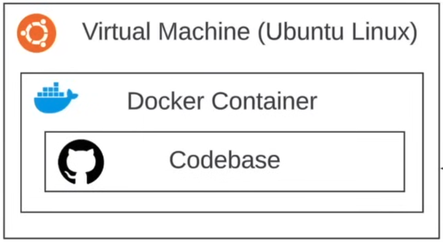

# Github Codespaces

A Cloud Developer Evironment (CDE) integrated with your Github repo.

A codespace runs:

- In a Ubuntu Linux Docker Container
  - ona virtual machine
    - hosted and managed by GitHub

