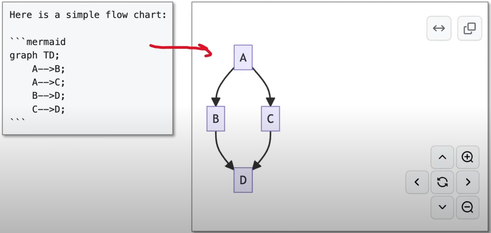
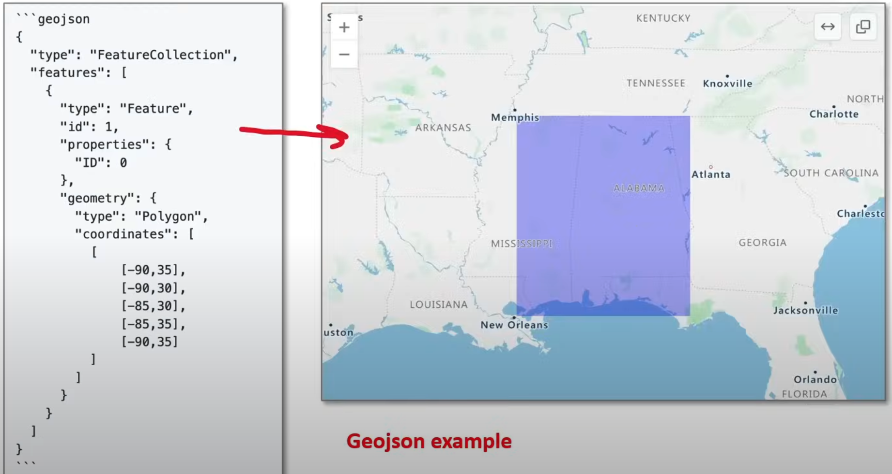
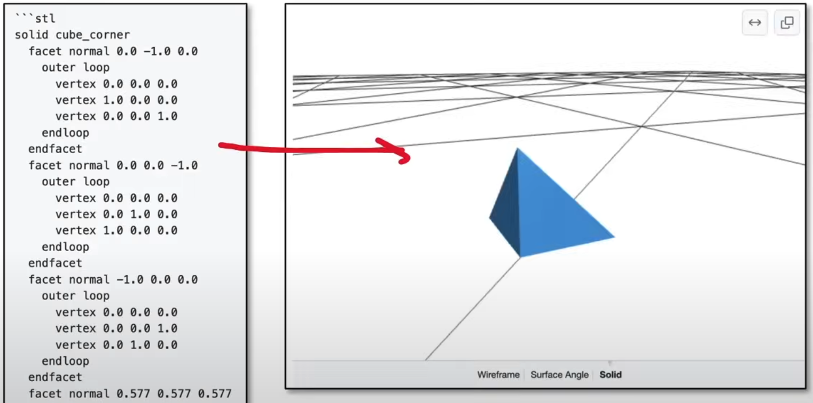

# GitHub Markdown

**Markup Language** - A way of formatting and presenting text data in a different format.

- A common use-case for a markup language is to present data in HTML.

**Markdown** - A markup language that provides a shorthand syntax to format information into HTML. Markdown is poplar due to its easy 
syntax, and being readable in its raw format.

**Slash Commands** - Provides convenience features such as formatting markdown.
    - Reminds me of ./ in Notion, that allows you to access and use different templates such as ./code in Notion that would spin up a code block versus using ```

## Github Flavoured Markdown

### Github Flavoured Markdown (GFM)

- The dialect of Markdown that is currently supported for user content on GitHub.com and GitHub Enterprise.

### Mermaid

- A Markdown inspired tool that renders text into diagrams.



### GeoJSON/TopoJSON syntax to create interactive maps.

- Syntax to create interactive maps.
- GeoJSON Example:
- 

### ASCII STL Syntax

Allows you to create interactive 3D models directly in Markdown.
