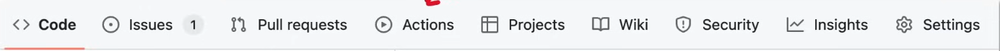
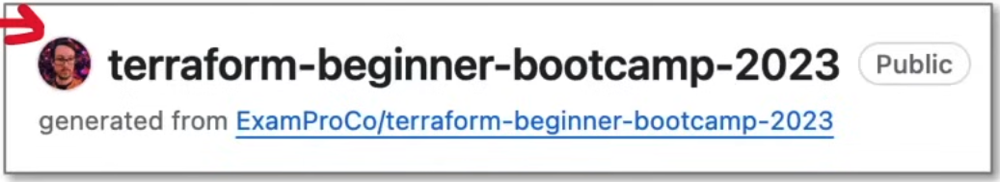

# Understanding GitHub Repos

## GitHub User Profile

**User Profile** - A  public GitHub account to showcase yourself as a developer.

- Profile picture and bio
- README.md
  - Allows you to place whatever you like on your profile.
  - In order to create a user profile readme you need to create a public repo with your username:
        - alexandroivaldez/alexandroivaldez
- Repositories
  - You can pin specific GitHub repos that you own to best showcase your projects.
- Contributions graph
- Followers and following
- Stars
- Organizations
- Contribution Activity
  - Will show how active (for public projects) you are on GitHub.

**Achievements** - Badges that you can earn for doing certain things. Kind of pointless and there's not a lot of them, but hey it's apparently on the exam.

## README.md

Markdown files that provided documentation/instructional information.
A repo that has a README.md or README file in project's ROOT will be rendered on the Github Repo page for each access. Basically it's the first page that's scene at the root of the project.

## Basic Repo Navigation



- **Code** - The main tab where the repo's source code, files and folders are located.

- **Issues** - Tracks problems or ideas for the project, allowing collaboration and discussion.

- **Pull Requests** - Used for managing contributions from other users, enabling code review and discussion before merging changes.

- **Actions** - Manages CI/CD workflows.

- **Wiki** - A space for project's documentation.

- **Security** - Features security-related resources, including security policies and vulnerability reports.

## Creating a New Repo

- When you create a repo you choose a owner:
  - Personal account
  - An organization that you belong to.

- You choose a name that's available within your username.
  - Names are unique based on the scope of the user.

- Your repo can either be public or private.

- You can quickly add these files form the creation page:
  - Readme file
  - .gitignore file
  - License file

GitHub CLI can be used to create a GitHub repo:

```shell
gh repo create my-project --public --clone
```

## Maintaining a Repo

1. You can change your repo name, but it may break external links pointing to your public repo.
2. You can change the base branch (default branch)

    - "main" is the unspoken best practice for naming your base branch.

3. You can opt-in-and-out of some features for your Github repo.
4. The Danger Zone:

- Contains actions you need to think twice about because they cannot be undone.
  - Change repo visibility
  - Disable branch protection rules
  - Transfer ownership
    - Person who receives a ownership transfer must accept the transfer on their email.
  - Archive this repository
  - Delete the repository

## Repo Templates

A feature for public repos that allow other GitHub users to make a copy of the contents of the template repo to use as starting point of their own repo.

**Templates are different from cloning because it's a clean repo with no previous history.**

Their repo will indicate that they generated their repo from the repo template:

