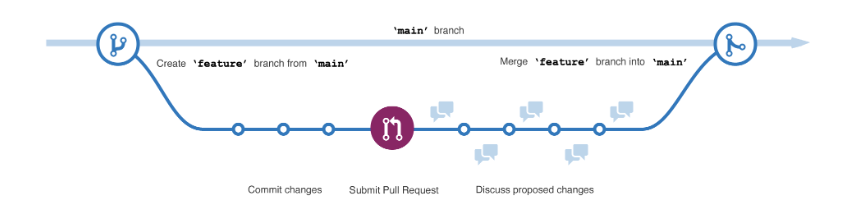

# Introduction to GitHub

**GitHub** - is a cloud-based platform that uses Git, a distributed version control system, at its core. The GitHub platform simplifies the process of collaborating on projects and provides a website, command-line tools, and overall flow that allows developers and users to work together.

## Introduction to Repositories

**Repository** - contains all of your project's files and each file's revision history. It is one of the essential parts that helps you collaborate with people. You can use repositories to manage your work, track changes, store revision history and work with others.

- **Public repositories** - are accessible to everyone on the internet.

- **Private repositories** - are only accessible to you, people you explicitly share access with, and, for organization repositories, certain organization members.

## What are gists?

**gists** - are a simplified way to share code snippets with others. Every gist is a Git repository, which you can fork and clone and can be either public or secret.

- **Public gists** - are displayed publicly where people can browse new ones as they’re created. Public gists are also searchable.

- **secret gists** - are not searchable, but they aren’t entirely private. If you send the URL of a secret gist to a friend, they'll be able to see it.

## What are wikis?

**Wiki** - Every repository on GitHub.com comes equipped with a section for hosting documentation.

- You can use your repository's wiki to share long-form content about your project, such as how to use it, how you designed it, or its core principles.
- It’s worth a reminder that if your repository is private only people who have at least read access to your repository will have access to your wiki.

## What are branches?

**Branches** - are an essential part to the GitHub experience because they're where we can make changes without affecting the entire project we're working on.

- Your branch is a safe place to experiment with new features or fixes. If you make a mistake, you can revert your changes or push more changes to fix the mistake. Your changes won't update on the default branch until you merge your branch.

## What are commits?

**commit** - a change to one or more files on a branch. Every time a commit is created, it's assigned a unique ID and tracked, along with the time and contributor. Commits provide a clear audit trail for anyone reviewing the history of a file or linked item, such as an issue or pull request.

Within a git repository, a file can exist in several valid states as it goes through the version control process:

The primary states for a file in a Git repository are:

**Untracked** - An initial state of a file when it isn't yet part of the Git repository. Git is unaware of its existence.

**Tracked** - A tracked file is one that Git is actively monitoring. It can be in one of the following substates:

- **Unmodified** - The file is tracked, but it hasn't been modified since the last commit.
- **Modified** - The file has been changed since the last commit, but these changes aren't yet staged for the next commit.
- **Staged** - The file has been modified, and the changes have been added to the staging area (also known as the index). These changes are ready to be committed.
- **Committed** - The file is in the repository's database. It represents the latest committed version of the file.

These states and substates are important to collaborating with your team to know where each and every commit is in the process of your project.

## What are pull requests?

**pull request** - is the mechanism used to signal that the commits from one branch are ready to be merged into another branch.

The team member submitting the pull request requests one or more reviewers to verify the code and approve the merge. These reviewers have the opportunity to comment on changes, add their own, or use the pull request itself for further discussion.

Once the changes have been approved (if approval is required), the pull request's source branch (the compare branch) is merged into the base branch.

## GitHub Flow

Now that we know the basics of GitHub we can walk through the GitHub flow and its components:

1. The first step of the GitHub flow is creating a branch so that the changes, features, and fixes you create don't affect the main branch.
2. The second step is to make your changes. We recommend deploying changes to your feature branch before merging into the main branch. Doing so ensures the changes are valid in a production environment.
3. The third step is to create a pull request to ask collaborators for feedback. Pull request review is so valuable that some repositories require an approving review before pull requests can be merged.
4. Next is the fourth step of reviewing and implementing your feedback from your collaborators.
5. The fifth step, once you’re feeling great about your changes now it's time to get your pull request approved and merge it into the main branch.
6. The sixth and final step is to delete your branch. Deleting your branch signals your work on the branch is completed and prevents you or others from accidentally using old branches.

And that’s it, you’ve been through a GitHub flow cycle!

## Issues

GitHub Issues were created to track ideas, feedback, tasks, or bugs for work on GitHub.

The different ways to create an issue from:

- a repository
- an item in a task list
- a note in a project
- a comment in an issue or pull request
- a specific line of code
- or a URL query

## Discussions

Discussions are for conversations that need to be accessible to everyone and aren't related to code. Discussions enable fluid, open conversation in a public forum.

## Subscriptions

You can choose to receive ongoing updates about specific activity on GitHub.com through a subscription. Notifications are the updates that you receive for specific activity to which you're subscribed.

You can choose to subscribe to notifications for:

- A conversation in a specific issue, pull request, or gist.
- All activity in a repository.
- CI activity, such as the status of workflows in repositories set up with GitHub Actions.
- Repository issues, pull requests, releases, security alerts, or discussions (if enabled).

## GitHub Pages

You can use GitHub Pages to publicize and host a website about yourself, your organization, or your project directly from a repository on GitHub.com.

GitHub Pages is a static site-hosting service that takes HTML, CSS, and JavaScript files straight from a repository on GitHub. Optionally, you can run the files through a build process and publishes a website.

Just edit and push your changes, and your project is live for the public in a visually organized way.
