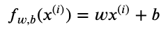
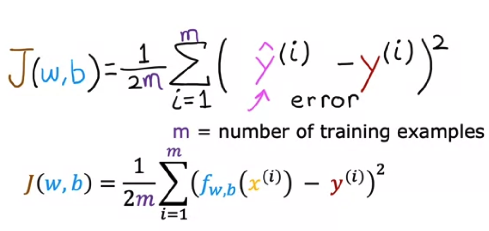

# Regression Model

## Terminology of ML

`Training Set` - Data used to train the model.

- x, feature, input variable

`Targets` - What you're trying to find.

- y, output variable

`m` - Number of training examples

`(x, y)` - Training example

`ŷ` - Prediction, estimated value of y, but not actually y.

## Linear Regression Model w/ One Variable



## Optional Lab: Model representation

Click [here](optional-lab-01.md) to view lab notes.

## Cost Function

```js
f(w,b) = wx + b
```

`w` and `b` - Parameters; variables you can change to improve the model.

- AKA coefficients, weights



The cost function formula determines how well the algorithm is doing based on the error from y hat - y.

## Optional Lab: Cost function

Click [here](optional-lab-02.md) to view lab notes.
