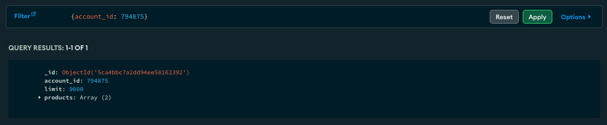

# Introduction to MongoDB Atlas

[Home](../README.md)

**MongoDB Atlas** - Developer data platform that provides services that developers can use.

- Provides operational insights, backups with point-in-time restore, and online archiving.

**Replica Set** - Your data is stored in more than one server; built in replication.

- Ensure data redundancy and high availability.

## Two Types of DB Deployments

### Serverless

Scales on demand, only charged for what you use.

### Clusters

Several mongoDB servers working together.

- M10 and M0

## Creating and Deploying an Atlas Cluster

### Organizations

Organizations allow you to group and define users and teams. You can then grant these users or teams access to projects.

### Projects

Projects allow you to define and organize resources. You can create separate projects for dev, test and prod.

## Atlas

### Filtering Documents in Atlas

You can use the filter bar to filter through your data. In the example below I'm filtering for a document with an account_id value of 794875.

## Proof of Completion

[Click Here](https://ti-user-certificates.s3.amazonaws.com/ae62dcd7-abdc-4e90-a570-83eccba49043/09d120a6-17b5-4e81-940e-cd158dd3e8ee-alexandro-valdez-6335f4cd-e1a1-452e-9489-72620e15485a-certificate.pdf)